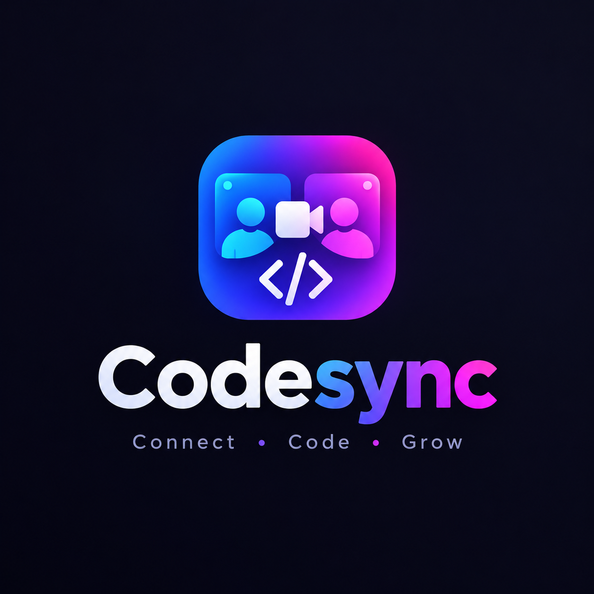
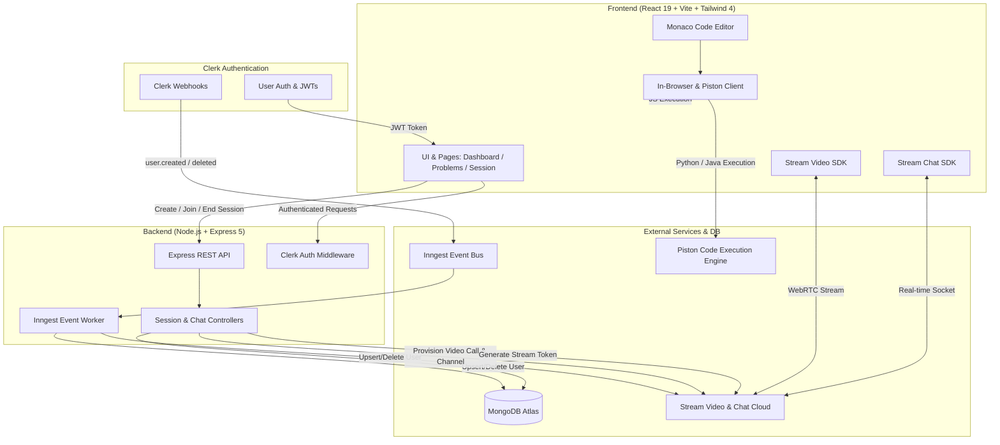

# 🚀 Talent IQ — Real-Time Collaborative Coding & Video Interview Platform

<div align="center">
  

  <h3>Connect • Code • Grow</h3>

  <p align="center">
    A full-stack, enterprise-grade peer-to-peer technical interview and collaborative coding platform featuring HD WebRTC video calling, real-time messaging, multi-language sandboxed code execution, and an interactive VS Code-powered Monaco editor.
  </p>

  <p align="center">
    
    
    
    
    
    
    
    
    
    
  </p>
</div>

---

## 📖 Table of Contents

- [🌟 Project Overview](#-project-overview)
- [✨ Key Features](#-key-features)
- [🏗️ System Architecture](#️-system-architecture)
- [💻 Tech Stack](#-tech-stack)
- [📂 Project Structure](#-project-structure)
- [🔌 API Endpoints](#-api-endpoints)
- [⚙️ Environment Configuration](#️-environment-configuration)
- [🚀 Quick Start & Installation](#-quick-start--installation)
- [🧪 Inngest Webhook Testing](#-inngest-webhook-testing)
- [📦 Production Deployment](#-production-deployment)
- [🤝 Contributing & License](#-contributing--license)

---

## 🌟 Project Overview

**Talent IQ** is designed to streamline modern technical hiring and peer mock interviews. Candidates and interviewers can join synchronized coding sessions, collaborate over low-latency HD video and audio, chat in real-time, solve algorithm problems, and execute test cases live in their browser or in isolated remote sandboxes.

The platform combines the speed of **Vite + React 19** with the robustness of **Express 5**, **MongoDB**, **Stream WebRTC/Chat SDKs**, and **Clerk Authentication**, orchestrated with **Inngest** for resilient event-driven background synchronization.

---

## ✨ Key Features

### 📹 1. HD WebRTC Video & Audio Calling
- Powered by **Stream Video React SDK**.
- Adaptive speaker and grid layouts with participant state indicators.
- Live audio/video toggle, screen sharing, device selection, and room status management.
- Dynamic room provisioning tied directly to interview session IDs.

### 💬 2. Live In-Session Sidebar Chat
- Integrated **Stream Chat React SDK** sidebar inside active interview rooms.
- Real-time text messaging, threads, user avatars, and instant delivery.
- One-click expandable sidebar drawer for seamless communication without distracting from the code.

### 💻 3. VS Code-Powered Monaco Code Editor
- Embedded **Monaco Editor** (`@monaco-editor/react`) delivering a desktop-grade IDE experience.
- Multi-language syntax highlighting for **JavaScript**, **Python**, and **Java**.
- Resizable split-pane layout using `react-resizable-panels` to customize problem description, editor, video call, and console output dimensions.

### ⚡ 4. Dual-Engine Code Execution System
- **In-Browser JavaScript Sandbox**: Instant client-side execution with captured custom console logs (`log`, `warn`, `error`, `info`) and zero API latency.
- **Piston API Remote Sandbox**: Secure remote code compilation and execution for multi-language test runs (Python, Java, JavaScript) capturing stdout, stderr, and execution exit codes.

### 🧩 5. Curated Problems Repository & Real-Time Test Runner
- Built-in library of algorithm challenges (Arrays, Hash Tables, Strings, Sliding Window, Dynamic Programming, Two Pointers).
- Detailed problem descriptions, markdown notes, constraints, and structured test cases.
- Real-time output normalization and pass/fail validation.
- Interactive celebration animations via `canvas-confetti` upon successful completion.

### 🔐 6. Secure Authentication & Event-Driven Sync
- **Clerk Authentication**: Passwordless login, social OAuth providers, and secure session management.
- **Inngest Event Synchronization**: Webhook background jobs that automatically sync user lifecycle events (`clerk/user.created`, `clerk/user.deleted`) across MongoDB and Stream user directories.

### 📊 7. Live Dashboard & Session Management
- Instant room creation specifying target problem, difficulty (`Easy`, `Medium`, `Hard`), and auto-generated call channels.
- Live active sessions feed with real-time participant badges and join controls.
- Host authorization gates allowing only hosts to conclude and clean up active sessions.
- History of completed sessions with user participation tracking.

---

## 🏗️ System Architecture



---

## 💻 Tech Stack

| Domain | Technology / Library | Description |
| :--- | :--- | :--- |
| **Frontend Framework** | `React 19`, `Vite 5` | High-performance SPA frontend |
| **Styling & UI** | `TailwindCSS 4`, `DaisyUI 5`, `Lucide React` | Modern dark-mode UI and customizable components |
| **Code Editor** | `@monaco-editor/react`, `react-resizable-panels` | VS Code-powered editor with flexible panel splitting |
| **Real-Time Video & Chat** | `@stream-io/video-react-sdk`, `stream-chat-react` | Low-latency WebRTC video calling and channel chat |
| **State & Data Fetching**| `@tanstack/react-query v5`, `Axios` | Server-state caching, mutations, and optimistic updates |
| **Routing & Navigation**| `react-router v8` | Client-side routing and protected routes |
| **Backend Runtime** | `Node.js (>= 20.12.0)`, `Express 5` | Scalable REST API server |
| **Database & ODM** | `MongoDB Atlas`, `Mongoose 8` | Document persistence for users and interview sessions |
| **Authentication** | `@clerk/express`, `@clerk/react` | User management, session tokens, and security |
| **Background Workflows**| `Inngest` | Reliable event-driven Clerk webhook syncing |
| **Code Execution Engine**| `Piston API` + Browser Sandboxing | Dual execution engine for multi-language code runs |
| **Interactive UX** | `canvas-confetti`, `react-hot-toast` | Celebration confetti and responsive toast alerts |

---

## 📂 Project Structure

```text
video interview platform/
├── backend/
│   ├── src/
│   │   ├── controllers/
│   │   │   ├── chatController.js       # Stream chat & video token generation
│   │   │   └── sessionController.js    # Create, join, end, and fetch sessions
│   │   ├── lib/
│   │   │   ├── db.js                   # MongoDB connection handler
│   │   │   ├── env.js                  # Centralized environment variable loader
│   │   │   ├── inngest.js              # Inngest client & user sync background functions
│   │   │   └── stream.js               # Stream Video and Chat server-side clients
│   │   ├── middleware/
│   │   │   └── protectRoute.js         # Clerk JWT authentication & user injection
│   │   ├── models/
│   │   │   ├── Session.js              # Session MongoDB schema
│   │   │   └── User.js                 # User MongoDB schema
│   │   ├── routes/
│   │   │   ├── chatRoutes.js           # /api/chat endpoints
│   │   │   └── sessionRoute.js         # /api/sessions endpoints
│   │   └── server.js                   # Express application entry & static serve
│   ├── .env                            # Backend environment variables
│   └── package.json
│
├── frontend/
│   ├── public/
│   │   ├── logo.png                    # Brand logo & Favicon asset
│   │   └── hero.png                    # Landing page hero illustration
│   ├── src/
│   │   ├── api/
│   │   │   └── sessions.js             # Session API service methods
│   │   ├── components/
│   │   │   ├── ActiveSessions.jsx      # Active session list with live cards
│   │   │   ├── CodeEditorPanel.jsx     # Monaco editor container with language selector
│   │   │   ├── CreateSessionModal.jsx  # New session modal dialog
│   │   │   ├── Navbar.jsx              # Navigation header with user profile menu
│   │   │   ├── OutputPanel.jsx         # Test execution console and results panel
│   │   │   ├── ProblemDescription.jsx  # Problem statement, examples, constraints
│   │   │   ├── RecentSessions.jsx      # Historical sessions card list
│   │   │   ├── StatsCards.jsx          # User metrics and analytics cards
│   │   │   ├── VideoCallUI.jsx         # WebRTC call layout, controls, and live chat
│   │   │   └── WelcomeSections.jsx     # Dashboard hero header & action button
│   │   ├── data/
│   │   │   └── problems.js             # Problem repository with starter code & test cases
│   │   ├── hooks/
│   │   │   ├── useSessions.js          # React Query hooks for session operations
│   │   │   └── useStreamClient.js      # Stream video & chat client initializers
│   │   ├── lib/
│   │   │   ├── axios.js                # Configured Axios client
│   │   │   ├── piston.js               # Dual-engine code execution utility
│   │   │   ├── stream.js               # Stream token provider helper
│   │   │   └── utils.js                # UI utility helpers
│   │   ├── pages/
│   │   │   ├── DashboardPage.jsx       # Main dashboard with rooms & stats
│   │   │   ├── HomePage.jsx            # Product landing & feature showcase page
│   │   │   ├── ProblemPage.jsx         # Solo practice coding workspace
│   │   │   ├── ProblemsPage.jsx        # Problems catalog list
│   │   │   └── SessionsPage.jsx        # Live collaborative interview workspace
│   │   ├── App.jsx                     # Root router & Clerk authentication gates
│   │   ├── index.css                   # Tailwind 4 & DaisyUI styles
│   │   └── main.jsx                    # React root entry point
│   ├── .env                            # Frontend environment variables
│   ├── index.html                      # HTML root template with logo favicon
│   ├── package.json
│   └── vite.config.js
│
├── package.json                        # Root orchestration scripts
└── README.md
```

---

## 🔌 API Endpoints

### 🔑 Authentication & Chat (`/api/chat`)
| Method | Endpoint | Protection | Description |
| :--- | :--- | :--- | :--- |
| `GET` | `/api/chat/token` | 🔒 Private | Generates a Stream user token for WebRTC video and chat synchronization. |

### 🎯 Sessions (`/api/sessions`)
| Method | Endpoint | Protection | Description |
| :--- | :--- | :--- | :--- |
| `POST` | `/api/sessions` | 🔒 Private | Creates an active session and provisions Stream video call and chat channel. |
| `GET` | `/api/sessions/active` | 🔒 Private | Retrieves all currently active sessions. |
| `GET` | `/api/sessions/my-recent` | 🔒 Private | Retrieves past completed sessions for the authenticated user. |
| `GET` | `/api/sessions/:id` | 🔒 Private | Retrieves detailed metadata for a specific session ID. |
| `POST` | `/api/sessions/:id/join` | 🔒 Private | Joins an active session as a participant. |
| `POST` | `/api/sessions/:id/end` | 🔒 Private | Concludes a session, deletes Stream call/channel, and archives record. |

### ⚡ Background Workflows (`/api/inngest`)
| Method | Endpoint | Protection | Description |
| :--- | :--- | :--- | :--- |
| `ALL` | `/api/inngest` | Inngest Signing | Handles event-driven jobs (`clerk/user.created`, `clerk/user.deleted`). |

---

## ⚙️ Environment Configuration

### 1. Backend Environment Variables (`backend/.env`)

```env
PORT=3000
NODE_ENV=development
CLIENT_URL=http://localhost:5173

# MongoDB Connection
DB_URL=mongodb+srv://<username>:<password>@cluster.mongodb.net/interviewDB

# Clerk Authentication
CLERK_PUBLISHABLE_KEY=pk_test_...
CLERK_SECRET_KEY=sk_test_...

# Stream Video & Chat API
STREAM_API_KEY=your_stream_api_key
STREAM_API_SECRET=your_stream_api_secret

# Inngest Background Tasks
INNGEST_EVENT_KEY=your_inngest_event_key
INNGEST_SIGNING_KEY=your_inngest_signing_key
```

### 2. Frontend Environment Variables (`frontend/.env`)

```env
# Clerk Publishable Key
VITE_CLERK_PUBLISHABLE_KEY=pk_test_...

# Backend API URL
VITE_API_URL=http://localhost:3000/api

# Stream Public API Key
VITE_STREAM_API_KEY=your_stream_api_key
```

---

## 🚀 Quick Start & Installation

### Prerequisites
- **Node.js**: `v20.12.0` or higher
- **npm**: `v10.x` or higher
- **MongoDB**: A free MongoDB Atlas cluster or local instance
- **Clerk Account**: Free API keys from [Clerk.com](https://clerk.com)
- **GetStream Account**: Free Video & Chat keys from [GetStream.io](https://getstream.io)

### Step 1: Clone Repository
```bash
git clone https://github.com/rohan-tech-negi/NewProject.git
cd "video interview platform"
```

### Step 2: Install Dependencies
```bash
# Install backend dependencies
cd backend
npm install

# Install frontend dependencies
cd ../frontend
npm install
```

### Step 3: Configure Environment
- Create `backend/.env` with your MongoDB, Clerk, Stream, and Inngest keys.
- Create `frontend/.env` with your Clerk and Stream public keys.

### Step 4: Run Development Servers

**Terminal 1 — Backend Server:**
```bash
cd backend
npm run dev
# Server running at http://localhost:3000
```

**Terminal 2 — Frontend Dev Server:**
```bash
cd frontend
npm run dev
# Frontend running at http://localhost:5173
```

---

## 🧪 Inngest Webhook Testing

To test user synchronization locally without deploying public webhooks:

```bash
# In a new terminal, launch the Inngest local dev server:
npx inngest-cli@latest dev -u http://localhost:3000/api/inngest
```
Open `http://localhost:8288` to inspect event triggers, send test events (`clerk/user.created`), and view step-by-step function executions.

---

## 📦 Production Deployment

The project supports a unified production build where the Express server serves both the REST API and the compiled React frontend:

```bash
# 1. Build the full-stack application from root
npm run build

# 2. Start the production server
npm start
```

When `NODE_ENV=production`, Express automatically serves static assets from `frontend/dist` and handles client-side routing.

---

## 🤝 Contributing & License

Contributions, issues, and feature requests are welcome!

1. Fork the Project
2. Create your Feature Branch (`git checkout -b feature/AmazingFeature`)
3. Commit your Changes (`git commit -m 'Add some AmazingFeature'`)
4. Push to the Branch (`git push origin feature/AmazingFeature`)
5. Open a Pull Request

Distributed under the **ISC License**. Built with ❤️ by [Rohan Negi](https://github.com/rohan-tech-negi).
